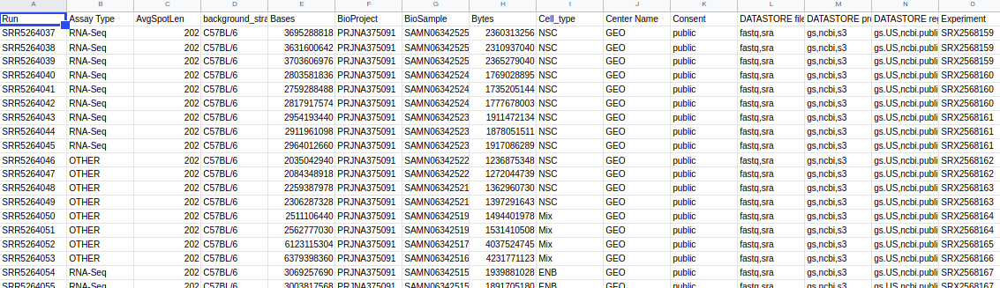

```{r setup, include=FALSE}
knitr::opts_chunk$set(echo = FALSE)
```

## Obtención de archivos fastq 

En primer lugar elegimos el directorio de trabajo y ponemos allı́ los archivos FASTQ que descaremos, por ejemplo de SRA

Para ello los vamos a descargar desde SRA usando la herramienta fastq-dump

* [sra-tools](https://github.com/ncbi/sra-tools/)

* [Downloading-SRA-Toolkit](https://github.com/ncbi/sra-tools/wiki/01.-Downloading-SRA-Toolkit/)

* [Installing-SRA-Toolkit](https://github.com/ncbi/sra-tools/wiki/02.-Installing-SRA-Toolkit)

* Ejemplo para linux:

```{bash fastq, echo=TRUE, eval=FALSE}
wget --output-document sratoolkit.tar.gz http://ftp-trace.ncbi.nlm.nih.gov/sra/sdk/current/sratoolkit.current-ubuntu64.tar.gz
```

Luego para comprobar que funciona correctamente:

```{bash fastqdump, echo=TRUE, eval=FALSE}
  fastq-dump --split-e  SRR5264037
```

Repetimos el comando para obtener todos los archivos que deseamos, ejemplo para nuestro experimento:

```{r selector, echo=FALSE,  out.width = '80%'}

```

# QC 

El primer paso que todo bioinformático que trabaja con datos en NGS y recibe archivos fastq del servicio de secuenciación o de un repositorio público, es analizar los archivos para verificar la calidad de los mismos antes de comenzar cualquier análisis. De esta manera podemos identificar rápidamente: 

* el número de lecturas de cada biblioteca

* la existencia de problemas técnicos si las muestras hubieran sido corridas en diferentes calles o aparatos y también con mucha separación en el tiempo. Lo mismo para el primer y segundo fragmento que se secuencia.

* la existencia de contaminantes, el tipo de biblioteca que se ha secuenciado (genómico, transcriptómica, amplicones) la calidad promedio de la biblioteca secuenciada.

# FASTQC + MultiQC

* Una de las herramientas más utilizadas es   [FastQC](https://www.bioinformatics.babraham.ac.uk/projects/fastqc/). En la sección de ayuda se puede profundizar sobre las conclusiones. 

* Se pueden agregar múltiples reportes fácilmente con la herramienta [MULTIQC](https://multiqc.info/)
Ejemplo: _(ver ejemplo en clase teórica)_

# Bioconductor 

Cargamos el paquete al entorno de trabajo. Vamos a analizar la calidad del archivo fastq con una función especial para ello 
\texttt{qa}


```{r ShortReadFake, echo=TRUE, eval=TRUE, message=FALSE}
library(ShortRead)
setwd("~/Documents/BioApps/data/QC")
countFastq("SRR5264037_1.fastq.gz")
fqQC <-qa("SRR5264037_1.fastq.gz")
```

```{r ShortRead, echo=FALSE, eval=FALSE, message=FALSE,results=FALSE}
library(ShortRead)
setwd("~/Documents/BioApps/data/QC")
countFastq("R1.fq.gz")
fqQC <-qa("R1.fq.gz")
```

La lectura del archivo se guardará en el objeto \textbf{fqQC}. 
El objeto que se generó ya contiene las métricas de calidad. Podemos imprimirlo en un reporte en formato HTML. 

_TIP: Verificar que el directorio donde se exporta la salida._

```{r report, echo=TRUE, eval=TRUE}
report(fqQC, type="html", dest="SRR5264037_QC")
```

Abrir el reporte en un navegador web. 

_TIP: Debajo de cada gráfico se especifican las funciones con las que se han realizado_

##  Paso a paso: 

Podemos hacerlos uno por uno:

```{r readCount, echo=TRUE, eval=TRUE}
ShortRead:::.plotReadCount(fqQC)
```

Este primer gráfico no es muy informativo ya que aquı́ solo estamos analizando el total de lecturas, sin tener en cuenta si han sido filtradas o alineadas. Además estamos mirando 1 sola muestra y sola lane.

```{r plot2, echo=TRUE, eval=TRUE}
ShortRead:::.plotNucleotideCount(fqQC)
```

En este segundo gráfico, podemos ver la frecuencia de aparición de cada base. Este cálculo podemos hacerlo manualmente también usando uno de los comandos que se señalan arriba.

```{r plot3, echo=TRUE, eval=TRUE}
df <- fqQC[["readQualityScore"]]
ShortRead:::.plotReadQuality(df[df$type=="read",])
```

En este caso observaremos la distribución de calidad en todo el archivo fastq. ¿Qué puede decir de la calidad de esta muestra? ¿Le resulta confiable para seguir trabajando?

```{r plot4, echo=TRUE, eval=TRUE}
df <- fqQC[["sequenceDistribution"]]
ShortRead:::.plotReadOccurrences(df[df$type=="read",], cex=.5)
```

Esta es una manera de representar la proporción de lecturas del mismo tipo. Idealmente la proporción cae abruptamente. las lecturas menos representadas suelen ser errores de secuenciación o fragmentos espúreos (lecturas infrecuentes, suelen ser ~10 % normalmente). Si hubiera lecturas demasiado sobrerepresentadas podriamos sospechar de alguna contaminación, también adaptadores, _primers_, artefactos como colas poliA, regiones altamente repetitivas, que reflejen algún error en la preparación de las muestras (5 % normalmente). 

Otra manera de verlo rápidamente:

```{r plot5, echo=TRUE, eval=TRUE}
ShortRead:::.freqSequences(fqQC, "read", n=10)

#las primeras 1000 secuencias más representadas
plot(ShortRead:::.freqSequences(fqQC, "read", n=1000)$count)
```

De acuerdo a lo que vimos sobre la tecnologı́a de secuenciación, podemos analizar cómo fue la calidad del _base calling_ ciclo a ciclo.

```{r plot6, echo=TRUE, eval=TRUE}
perCycle <- fqQC[["perCycle"]]
ShortRead:::.plotCycleBaseCall(perCycle$baseCall)
ShortRead:::.plotCycleQuality(perCycle$quality)
```

* Aparece una frecuencia diferente de la esperada al azar para estas primeras bases cuando estamos trabajando con bibliotecas de RNA debido a que el proceso de pasar de RNA a cDNA requiere de _primers random_ que suelen tener preferencias por algunos sitios, aunque uno esperarı́a que fuera al azar. En este punto hay que prestar atención para distinguir rápidamente qué tipo de biblioteca estamos analizando. 

* Con respecto a la calidad ciclo por ciclo, los primeros ciclos en la tecnologı́a de Illumina suelen tener calidades menores a las del resto de la secuencia. No es para preocuparse, tiene relación con los algoritmos que llevan a cabo el proceso de identificación de la base a partir de las señales lumı́nicas y la identificación de los _clusters_.

* ¿Qué podemos decir del archivo fastq que se ha analizado? ¿Qué información relevante nos otorgan este tipo de análisis?

## Vignette
En la [vignette](http://bioconductor.org/packages/release/bioc/vignettes/ShortRead/inst/doc/Overview.pdf) hay más funcionalidades para explorar.


## Repaso

Repetir el ejercicio con el **SRR5264037_2.fastq.gz** y completar el [cuestionario](https://forms.gle/k6JyYxuGm87SWHcz6)
    

