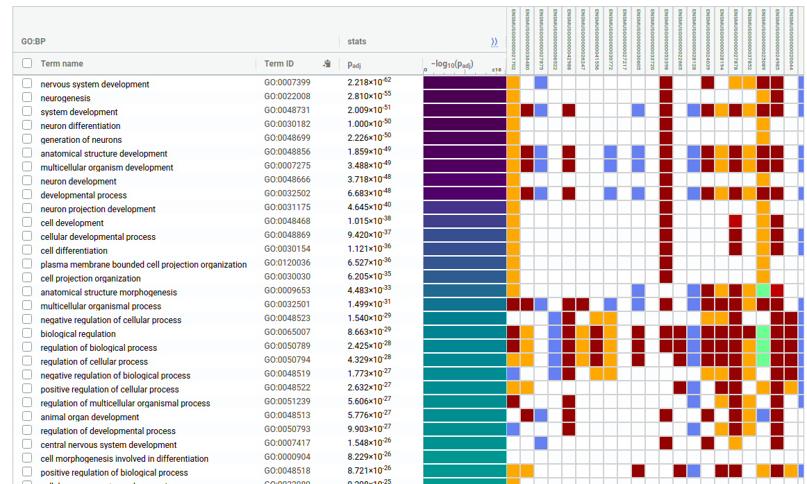

```{r setup, include=FALSE}
knitr::opts_chunk$set(echo = FALSE)
```


## Tabla de conteos

Luego del alineamiento hay que contar cuántas lecturas han caı́do en cada región de interés y dependerá nuevamente de nuestra pregunta biológica y de la referencia contra la que hayamos decidido alinear. 

En nuestro caso, con STAR, usando el parámetro **--quantMode GeneCounts**, por cada alineamiento, también se obtiene un archivo en formato tabular con las lecturas que se superponen a las coordenadas de los genes. 

Podemos inspeccionar como fueron las métricas de los alineamientos, usando la herramienta MultiQC: 
[STARQC](https://estepi.github.io/RNA-Seq_II_esp/STARQC/multiqc_report.html)

# Detección de genes diferencialmente expresados

Una vez que tenemos las tablas de conteos hay que realizar el análisis de los datos para buscar aquellos genes que se hayan comportado diferente en las condicones en estudio. 

En este caso, analizaremos datos de un trabajo cuyo objetivo es analizar el impacto sobre la remodelación del transcriptoma durante 2 momentos de la neurodiferenciacición.

La sucesión de estadíos es: NSC-->ENB-->LNB

El diseño experimental es una comparación entre **3 estados o  condiciones **, con **3 réplicas** biológicas cada una.

Antes de empezar armamos un archivo *targets* o *mapping file* donde se detalla cada muestra a qué condición corresponde 

Empezaremos con una compracion entre 2 condiciones: NSC vs ENB

Cargaremos la tabla de counts a nivel gen. Especificamos algunas opciones tales como cuál es la colunma que le da nombre a las filas _(row.names = 1)_, así como si los nombres de las columnas. Para saber sobre estas especificaciones puede consultar el help de *read.table*.

Cargamos todas los paquetes que usaremos:

```{r libraries, eval=TRUE, echo=TRUE, message=FALSE}
library(ggplot2)
library(reshape2) 
library(edgeR)
library(ggrepel)
library(org.Mm.eg.db)
```

```{r readt, echo=FALSE, eval=TRUE}
counts <-
    read.table(
        "~/Documents/BioApps/data/mouse/STAR/geneCountsMmu.tab",
        row.names = 1,
        header = T,
        stringsAsFactors = F
    )
```

```{r readc, echo=TRUE, eval=FALSE}
counts <-
    read.table(
        "/home/alumno01/data/mouse/geneCountsMmu.tab",
        row.names = 1,
        header = T,
        stringsAsFactors = F
    )
```

¿Qué tipo de objeto es **counts**? ¿Qué dimensiones tiene? ¿Cómo luce?

Para explorar un poco la tabla de datos, miremos algunas medidas resumen y la distribucion de los counts:


```{r summary, echo=TRUE, eval=TRUE}
class(counts)
dim(counts)
head(counts)
summary(counts)
```

* ¿Cuántos genes fueron mapeados?

# Comparación entra las condiciones **NSC-->ENB**

El primer paso entonces es subsetear la tabla y la podemos reordenar ya de acuerdo a las condiciones a comparar (por practicidad):

```{r dataset1, echo=TRUE, eval=TRUE}
dataset1<-counts[,c(7,8,9,1,2,3)]
head(dataset1)
```

Podemos explorar usando boxplots como es la distribución de los counts en las diferentes muestras:

```{r summaryGgplot2, echo=TRUE, eval=TRUE}
df<- melt(dataset1)
ggplot(df, aes(x=variable, y=value, fill=variable)) + 
  geom_boxplot()+
  theme_classic()+
  labs(title="Read distribution")
```
 
* Hay genes que tienen una cantidad de lecturas extraordinaria. ¿Cuáles son?

```{r summaryGgplot, echo=TRUE, eval=TRUE}
highlyExpress<-rowMeans(dataset1)>50000
dataset1[which(highlyExpress),]
```


Podemos regraficar excluyendo aquellos genes con > 100000 lecturas por ejemplo:

```{r boxplotsGGylim, echo=TRUE, eval=TRUE}
ggplot(df, aes(x=variable, y=value, fill=variable)) + 
  geom_boxplot()+
  theme_classic()+
  labs(title="Read distribution")+ 
  ylim(0, 100000)
```


# Filtros

* Es recomendable filtrar los datos para eliminar aquellas filas (genes) que hayan recibido 0 o pocas lecturas. Para ello, aplicamos una conversión a los counts crudos usando la función cpm, que simplemente divide las lecturas por el total de lecturas de su biblitoeca y multiplica por 1M. 

* Es recomendable remover genes sin al menos 1 read por millon en N de las muestras (donde N será el tamaño del grupo con menor número de réplicas - acá ambos tienen 3). Para estos genes es muy difı́cil detectar expresión diferencial asi que no hay que tener miedo a removerlos.

También podemos probar con diferentes umbrales. No hay una regla estricta, dependerá del experimento en concreto


```{r filtros, echo=TRUE, eval=TRUE}
cpms<-cpm(dataset1)
```

Armamos un nuevo objeto y sobre el realizamos el filtro:

```{r keep, echo=TRUE, eval=TRUE}
keep<-rowSums(cpms>1)>3
summary(keep)
```

¿Qué tipo de vector es **keep**? ¿Para qué voy a utilizarlo? ¿Qué longitud tiene? ¿Cuántos valores son **TRUE**? 

Controlemos la dimensión de la matriz original y filtrada, una vez que subseteamos con el vector **keep**:


```{r keep2, echo=TRUE, eval=TRUE}
dim(counts)
countsf<-counts[keep,]
dim(countsf)
```

Repetimos las medidas resumen y gráficos exploratorios:

```{r keep3, echo=TRUE, eval=TRUE}
summary(countsf)
```

* En el caso de **edgeR** tenemos una función que puede filtar de manera menos arbitraria y se trabaja sobre la tabla cruda (_filterByExpr()_)

Para comenzar a trabajar creamos un objeto de tipo **DGELis**t que es propio del paquete **edgeR**. tenemos que pasarle los conteos y un vector factorial con las condiciones de cada muestra. 

_Importante: Hay que chequear que el vector con las condiciones o grupo, coincida con nuestras muestras._

```{r condition, echo=TRUE, eval=TRUE}
condition<-factor(rep(c("NSC","ENB"), each=3))
condition
```

* Cuidado acá porque el vector condition tiene que ser factorial y hay que definir el orden de los factores a mano (por defecto se ordenarán alfabéticamente)

Para cambiarlo:


```{r conditionFactor, echo=TRUE, eval=TRUE}
condition<-factor(rep(c("NSC","ENB"), each=3), 
                  levels = c("NSC","ENB"))
levels(condition)
```

Para comprobar que el contraste que analizaremos está en el orden correcto, usaremos la función **model.matrix** (la veremos en la práctica más avanzada)

```{r modelM, echo=TRUE, eval=TRUE}
design <- model.matrix(~ condition)
design
```

```{r DGELIST, echo=TRUE, eval=TRUE}
y <- DGEList(counts=dataset1, group=condition)
keep <- filterByExpr(y)
summary(keep)
y <- y[keep, , keep.lib.sizes=FALSE]
dim(y)
```

Exploremos el objeto. Es un objeto de tipo _lista_, pero propia de **edgeR**. Cada uno de los componentes en este caso se denomina slot. 

¿Qué información sobre nuestras muestras se ha incorporado en este objeto? 

## Estimación de los factores de normalización 

* La cantidad de lecturas que son contadas por gen son proporcionales a su longitud y a su expresión. Si quisiéramos tener una medida de la expresión absoluta habrı́a que tener en cuenta la longitud. 

* En este análisis estamos concentrados en evaluar las diferencias de expresión entre 2 condiciones. Sólo se tienen en cuenta factores técnicos que deben ser corregidos antes de llevar a cabo el análisis de expresión diferencial. 

* El más influyente es el que se denomina profundidad de la corrida es corregido teniendo en cuenta el tamaño de la biblioteca. 

* Otro factor que es importante es la çomposición de la biblioteca: hay genes muy expresados que consumen muchas lecturas causando que los demás genes menos expresados sean subsampleados. Sobre el objeto, calcularemos los factores de normalización. Volver a explorar el objeto original y observar qué cambios se produjeron.

```{r calcNormF, echo=TRUE, eval=TRUE}
y <- calcNormFactors(y)
y
```

Se han agregado los factores de normalización que se usarán al momento de estimar la expresión diferencial. Los mismos son bastante cercanos a 1, lo que significa que las bibliotecas son bastante similares en cuanto al número de lecturas totales. 

## Relación entre réplicas 

Tenemos una función para explorar las muestras con un gráfico de bajas dimensiones (tipo PCA)

```{r names, echo=TRUE, eval=TRUE}
plotMDS(y, labels=condition,
col=c("darkgreen","blue")[factor(condition)])
```

* Esta función calculará las distancias euclı́deas entre cada para de muestras y representará en un gráfico de 2 dimensiones cómo es la relación entre las muestras. * Podemos observar si en el experimento la separación entre condiciones es suficientemente robusta y cómo es la relación entre las réplicas. 

## Dispersión

En edgeR podemos estimar la dispersión usando diferentes estrategias: 
```{r dispDC, echo=TRUE, eval=TRUE}
yD <- estimateCommonDisp(y, verbose=TRUE)
#coeficiente de variación biológica
```

* Tagwise: siempre hay que calcular primero la dispersión común:

```{r dispDT, echo=TRUE, eval=TRUE}
yD <- estimateTagwiseDisp(yD)
```

Se recomienda usar la función _estimateDisp()_, que estima _common dispersion_ y _tagwise dispersions_ en 1 solo paso:

```{r disp, echo=TRUE, eval=TRUE}
y <- estimateDisp(y, verbose=TRUE)
y$common.dispersion
sqrt(y$common.dispersion)
summary(y$trended.dispersion)
summary(y$tagwise.dispersion)
```

* En este caso la dispersión tiene 2 componentes: la técnica y la biológica. La biológica es la raı́z cuadrada de la dispersión.

* Si analizamos cómo se comporta el Coeficiente de variación Biológica, vemos que es superior la dispersión común a bajas concentraciones de lecturas. Esto hace que sea más apropiado, establecer una dispersión gen a gen y no utilizar la misma dispersión común para todos.

Para analizar la nube de puntos gráficamente, podemos usar la función _plotBCV_

```{r plotBCV, echo=TRUE, eval=TRUE}
plotBCV(y)
```

# Expresión diferencial

Ya estamos en condiciones de testear la expresión diferencial. Para ello **edegR** tiene la función *exactTest*. La misma necesitará la dispersión que acabamos de calcular y el par que queremos comparar. Este es un test que se utiliza para evaluar diferencias entre pares, bajo una distribución binomial negativa. Como resultado del test, obtenemos los _pvalues_ para cada comparación. El resultado del test lo guardamos en un objeto nuevo **de**. 

```{r exactTest, echo=TRUE, eval=TRUE}
de<-exactTest(y)
str(de)
head(de)
```

¿Qué tenemos en el objeto **de**?

Con la función **topTags** se ordenarán los genes por su _pvalue_ corregido. Por defecto se muestran los top 10:

```{r toptagsDefault, echo=TRUE, eval=TRUE}
tt <- topTags(de)
tt
```

Pdemos extraer la cantidad de genes que especifiquemos, por ejemplo **TODOS** los genes testeados:

```{r toptags, echo=TRUE, eval=TRUE}
tt <- topTags(de, n = nrow(de))
```

_¿Cuáles son los genes que están más afectado en este experimento? ¿Tiene lógica?_

Podemos explorar rápidamente cómo se distribuyeron los _pvalues_:

```{r toptags2, echo=TRUE, eval=TRUE}
summary(tt$table$FDR)
table(tt$table$FDR <0.05)

df <- data.frame(
  exp="ENB",
  fdr=tt$table$FDR)
# Change colors
ggplot(df, aes(x=fdr)) + 
geom_histogram(color="black", fill="white", binwidth=0.01)+
geom_vline(xintercept=0.05, linetype="dashed")+
theme_classic()+
labs(title="FDR distribution")
```

## MA plot

Para visualizar cómo es la relación entre los genes, la tasa de cambio y la expresión podemos utilizar un gráfico de **logFC vs counts ** que ya habı̀amos utilizado, solo que en este caso vamos a marcar con otro color aquellos que tienen un pvalue corregido 0.1. Estos se denominarán **topTags**:

```{r deg, echo=TRUE, eval=TRUE}
deg<-rownames(tt)[tt$table$FDR <.05 &   
                  abs(tt$table$logFC )>1 ]
plotSmear(y, de.tags=deg)
abline(h=c(-1,0,1))
```

* En nuestro caso observamos el cociente entre cada uno de los genes y la media de expresion de cada gen (en cpm). 

* ¿Qué observamos? Muchos genes se encuentran sobre la región central, significa que no han cambiado como era esperable. El corte de pvalue y logFC es arbitrario y dependerá del experimento que estemos analizando. 

* Recordar que en el vector **deg** se han guardado los nombres de los genes que consideramos diferencialmente expresados con nuestro criterio. Para exportar los datos a un archivo en formato tabular, simplemente imprimo con el comando: 

## Vulcano plot (casi el último esfuerzo)

```{r degGGPLOT, echo=TRUE, eval=TRUE, warning=FALSE}
ttable <-tt$table
dim(ttable)
tt10 <- topTags(de, n=20)

ttable$gene_color <- rep("grey", nrow(ttable))
ttable$gene_color[ttable$logFC>1] <-"red"   
ttable$gene_color[ttable$logFC< (-1)]<-"green"
ttable$imp_genes<-NA

ii <- match(rownames(tt10), rownames(ttable))
ttable$imp_genes[ii]<-rownames(ttable)[ii]

ggplot(ttable, aes(x=logFC, y=-log10(FDR))) +
  geom_point(aes(col=gene_color), cex= 1.2) +
  scale_color_manual(values=c("dark green","dark grey", "dark red")) +
  labs(title="DEG NSC - ENB", x="log2(FC)", y="-log10(FDR)") +
  geom_vline(xintercept= c(-1, 1), colour= 'black', linetype= 'dashed') +
  geom_hline(yintercept= 1.30103, colour= 'black', linetype= 'dashed') +
  theme_minimal()+
  theme(legend.position = "none",
        plot.title = element_text(size = 12, face="italic", hjust=0.4),
        axis.title.x = element_text(color = "black", size=12, hjust = 0.4),   
        axis.title.y = element_text(size =12, hjust = 0.5)) +
  geom_text_repel(data=ttable,
                  aes(x=logFC, y=-log10(FDR)), 
                  label =ttable$imp_genes,
                  box.padding = unit(0.25, "lines"),
                  hjust =1,
                  max.overlaps = 50)

```

Exportamos los resultados en formato tabular, para futuros análisis:
```{r tt2, echo=TRUE, eval=FALSE}
write.csv(tt$table, file="ENB_edgeR.csv")
tt500 <- topTags(de, n =500)
write.csv(tt500$table, file="top500_ENB_edgeR.csv")
```

## Un poquito más...
* Cambiamos el ensembl ID por el symbol. Vamos a usar los paquetes del paradigma:  **org.XX.eg.db**
* Son muy prácticos para trabajar con Bioconductor

```{r ordDB, echo=TRUE, eval=TRUE}
MmuENS <- toTable(org.Mm.egENSEMBL2EG); head(MmuENS)
MmuSYMBOL <- toTable(org.Mm.egSYMBOL); head(MmuSYMBOL)
```

* Agregamos Entrez Id:

```{r mapDB, echo=TRUE, eval=TRUE}
gi <- match(rownames(ttable), MmuENS$ensembl_id)
length(which(is.na(gi)))
ttable$ensemble_id <- rownames(ttable)
ttable$EntrezId <- MmuENS$gene_id[gi]
```

* Y symbol a nuestras tablas:

```{r mapsymbol, echo=TRUE, eval=TRUE}
si <- match(ttable$EntrezId, MmuSYMBOL$gene_id)
length(which(is.na(si)))#983
ttable$Symbol <- MmuSYMBOL$symbol[si]
head(ttable)
```

* Ahora podemos repetir el vulcano plot con el **symbol** como etiqueta:

```{r vulcanoSymbol, echo=TRUE, eval=TRUE}
ii <- match(rownames(tt10), rownames(ttable))
ttable$imp_genes[ii]<-ttable$Symbol[ii]

ggplot(ttable, aes(x=logFC, y=-log10(FDR))) +
  geom_point(aes(col=gene_color), cex= 1.2) +
  scale_color_manual(values=c("dark green","dark grey", "dark red")) +
  labs(title="DEG NSC - ENB", x="log2(FC)", y="-log10(FDR)") +
  geom_vline(xintercept= c(-1, 1), colour= 'black', linetype= 'dashed') +
  geom_hline(yintercept= 1.30103, colour= 'black', linetype= 'dashed') +
  theme_minimal()+
  theme(legend.position = "none",
        plot.title = element_text(size = 12, face="italic", hjust=0.4),
        axis.title.x = element_text(color = "black", size=12, hjust = 0.4),   
        axis.title.y = element_text(size =12, hjust = 0.5)) +
  geom_text_repel(data=ttable,
                  aes(x=logFC, y=-log10(FDR)), 
                  label =ttable$imp_genes,
                  box.padding = unit(0.25, "lines"),
                  hjust =1,
                  max.overlaps = 50)

```

## Gene Ontology

Podemos analizar enriquecimientos ontológicos de una forma muy sencilla:

* Primero hay que agregar EntrezID al objeto **de**:

```{r GOtest, echo=TRUE, eval=TRUE}
entrezi <- match(rownames(de), MmuENS$ensembl_id)
length(which(is.na(entrezi)))
de$ensemble_id <- rownames(de)
de$EntrezId <- MmuENS$gene_id[entrezi]
```

* Ahora vamos testeando, con diferentes opciones la lista de genes **de**

* Procesos Biológicos:
```{r GOtestBP, echo=TRUE, eval=TRUE}
go <- goana(de, species = "Mm", geneid=de$EntrezId)
topBPUp<-topGO(go, ont="BP", n=30, truncate=30, sort = "Up")
head(topBPUp)# enriquecimiento sobreexpresados

topBPDown<-topGO(go, ont="BP", n=30, truncate=30, sort = "Down")
head(topBPDown)
```

* Función molecular (MF)
```{r GOtestMF, echo=TRUE, eval=TRUE}
topMF<-topGO(go, ont="MF", n=30, truncate=30)
head(topMF)
```

* Componentes celulares (CC)
```{r GOtestCC, echo=TRUE, eval=TRUE}
topCC<-topGO(go, ont="CC", n=30, truncate=30)
head(topCC)
```
* Vías metabólicas usando KEGG:

```{r GOtesKEGG, echo=TRUE, eval=TRUE}
keg <- kegga(de, species="Mm",  geneid=de$EntrezId)
topKEGG(keg)
```

* gProfiler: \url{https://biit.cs.ut.ee/gprofiler/gost}

```{r BP, echo=FALSE,  out.width = '80%'}

```

```{r si, echo=TRUE, eval=TRUE}
sessionInfo()
```

