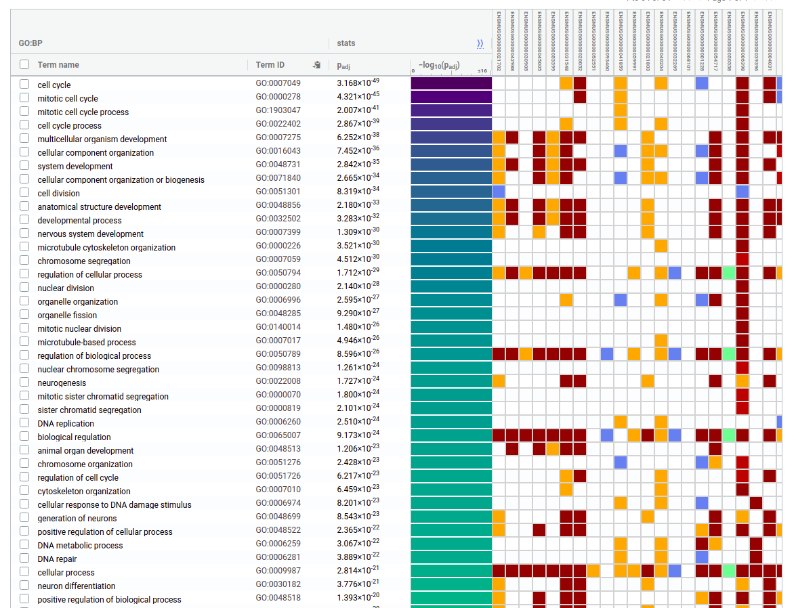

```{r setup, include=FALSE}
knitr::opts_chunk$set(echo = FALSE)
```

Cargamos todas los paquetes que usaremos:

```{r libraries, include=FALSE, eval=TRUE}
library(ggplot2)
library(reshape2) 
library(edgeR)
library(ggrepel)
```

## Tabla de conteos

Ahora miraremos la DE entre LSC vs ENB

```{r readt, echo=TRUE, eval=TRUE}
counts <-
    read.table(
        "~/Documents/BioApps/data/mouse/STAR/geneCountsMmu.tab",
        row.names = 1,
        header = T,
        stringsAsFactors = F
    )
```

# Comparación entra las condiciones **NSC-->LNB**


```{r dataset2, echo=TRUE, eval=TRUE}
dataset2<-counts[,c(7,8,9,4,5,6)]
head(dataset2)
```

Podemos explorar usando boxplots como es la distribución de los counts en las diferentes muestras:

```{r summaryGgplot2, echo=TRUE, eval=TRUE}
df<- melt(dataset2)
ggplot(df, aes(x=variable, y=value, fill=variable)) + 
  geom_boxplot()+
  theme_classic()+
  labs(title="Read distribution")
```
 
* Hay genes que tienen una cantidad de lecturas extraordinaria. ¿Cuáles son?

```{r summaryGgplot, echo=TRUE, eval=TRUE}
highlyExpress<-rowMeans(dataset2)>50000
dataset2[which(highlyExpress),]
```


Podemos regraficar excluyendo aquellos genes con > 100000 lecturas por ejemplo:

```{r boxplotsGGylim, echo=TRUE, eval=TRUE}
ggplot(df, aes(x=variable, y=value, fill=variable)) + 
  geom_boxplot()+
  theme_classic()+
  labs(title="Read distribution")+ 
  ylim(0, 100000)
```


# Filtros

* En el caso de edgeR tenemos una funcion que puede filtar de manera menos arbitraria y se trabaja sobre la tabla cruda

Para comenzar a trabajar creamos un objeto de tipo **DGELis**t que es propio del paquete **edgeR**. tenemos que pasarle los conteos y un vector factorial con las condiciones de cada muestra. 

_Importante: Hay que chequear que el vector con las condiciones o grupo, coincida con nuestras muestras._

```{r conditionFactor, echo=TRUE, eval=TRUE}
condition<-factor(rep(c("NSC","LNB"), each=3), 
                  levels = c("NSC","LNB"))
levels(condition)
```

Para comprobar que el contraste que analizaremos está en el orden correcto, usaremos la función **model.matrix** (la veremos en la práctica más avanzada)

```{r modelM, echo=TRUE, eval=TRUE}
design <- model.matrix(~ condition)
design
```

```{r DGELIST, echo=TRUE, eval=TRUE}
y <- DGEList(counts=dataset2, group=condition)
keep <- filterByExpr(y)
y <- y[keep, , keep.lib.sizes=FALSE]
dim(y)
```

## Estimación de los factores de normalización 


```{r calcNormF, echo=TRUE, eval=TRUE}
y <- calcNormFactors(y)
y
```

## Relación entre réplicas 


```{r names, echo=TRUE, eval=TRUE}
plotMDS(y, labels=condition,
col=c("darkgreen","blue")[factor(condition)])
```


## Dispersión

```{r names2, echo=TRUE, eval=TRUE}
y <- estimateDisp(y, verbose=TRUE)
y <- estimateCommonDisp(y,verbose = T)
y <- estimateTagwiseDisp(y, verbose = T)
```

```{r plotBCV, echo=TRUE, eval=TRUE}
plotBCV(y)
```

# Expresión diferencial

```{r exactTest, echo=TRUE, eval=TRUE}
de<-exactTest(y, pair = c("NSC","LNB"))
str(de)
head(de)
```


```{r toptagsDefault, echo=TRUE, eval=TRUE}
tt <- topTags(de)
tt
```


```{r toptags, echo=TRUE, eval=TRUE}
tt <- topTags(de, n = nrow(de))
```

_¿Cuáles son los genes que están más afectado en este experimento? ¿Tiene lógica?_


```{r toptags2, echo=TRUE, eval=TRUE}
table(tt$table$FDR <0.05)

df <- data.frame(
  exp="LNB",
  fdr=tt$table$FDR)
# Change colors
ggplot(df, aes(x=fdr)) + 
geom_histogram(color="black", fill="white", binwidth=0.01)+
geom_vline(xintercept=0.05, linetype="dashed")+
theme_classic()+
labs(title="FDR distribution")
```

## MA plot


```{r deg, echo=TRUE, eval=TRUE}
deg<-rownames(tt)[tt$table$FDR <.05 &   
                  abs(tt$table$logFC )>1 ]
plotSmear(y, de.tags=deg)
abline(h=c(-1,0,1))
```

## VULCANO PLOT 

```{r degGGPLOT, echo=TRUE, eval=TRUE, warning=FALSE}
forPlot <-tt$table
tt10 <- topTags(de, n=10)

forPlot$gene_color <- rep("grey", nrow(forPlot))
forPlot$gene_color[forPlot$logFC>1] <-"red"   
forPlot$gene_color[forPlot$logFC< (-1)]<-"green"
forPlot$imp_genes<-NA

ii <- match(rownames(tt10), rownames(forPlot))
forPlot$imp_genes[ii]<-rownames(forPlot)[ii]


ggplot(forPlot, aes(x=logFC, y=-log10(FDR))) +
  geom_point(aes(col=gene_color), cex= 1.2) +
  scale_color_manual(values=c("dark green","dark grey", "dark red")) +
  labs(title="DEG LNB", x="log2(FC)", y="-log10(FDR)") +
  geom_vline(xintercept= c(-1, 1), colour= 'black', linetype= 'dashed') +
  geom_hline(yintercept= 1.30103, colour= 'black', linetype= 'dashed') +
  theme_minimal()+
  theme(legend.position = "none",
        plot.title = element_text(size = 12, face="italic", hjust=0.4),
        axis.title.x = element_text(color = "black", size=12, hjust = 0.4),   
        axis.title.y = element_text(size =12, hjust = 0.5)) +
  geom_text_repel(data=forPlot,
                  aes(x=logFC, y=-log10(FDR)), 
                  label =forPlot$imp_genes,
                  box.padding = unit(0.25, "lines"),
                  hjust =1,
                  max.overlaps = 50)
```

```{r tt2, echo=TRUE, eval=FALSE}
write.csv(tt$table, file="LNB_edgeR.csv")
tt500 <- topTags(de, n =500)
write.csv(tt500$table, file="top500_LNB_edgeR.csv")
```

# Un poquito más

* Gene Ontology: \url{https://biit.cs.ut.ee/gprofiler/gost}


```{r BP, echo=FALSE,  out.width = '80%'}

```

* Recuperar los SYMBOLS usando los ensembl IDs 


